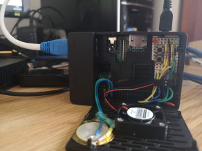

---
# Feel free to add content and custom Front Matter to this file.
# To modify the layout, see https://jekyllrb.com/docs/themes/#overriding-theme-defaults

layout: home
---

{: style="float:left;margin-right:10px"}

This is what I'm working on.
I set up Jekyll first. I think my next projects are going to be some Raspberry Pi and dotnet projects. When I have something worth reading I'll post it here.
{: style="padding-top:20px"}

&nbsp;

 

